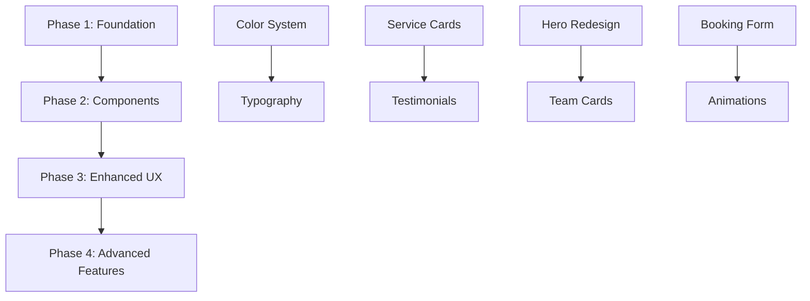

# Jules AI Integration Plan: Herrington → Dr. Islam Implementation

## 🎯 Strategic Overview

This plan leverages Jules AI to implement Herrington theme's professional UI/UX elements into the Dr. Islam website while preserving our modern edge-computing architecture and Arabic/English dual-language support.

### Current Project Analysis
- **Architecture**: Cloudflare Workers + Vanilla JS + CSS-in-JS
- **Language Support**: English/Arabic with RTL
- **CSS Structure**: 3-file system (core → components → enhancements)
- **Completion**: 44% (need customer-visible features fast)
- **Deployment**: Auto-deploy on git push

### Herrington Assets Available
- ✅ Professional color palette and design system
- ✅ Medical service cards with animations
- ✅ Patient testimonial system
- ✅ Responsive grid layouts
- ✅ Accessibility compliance

## 📋 Jules Task Breakdown Strategy

### Phase 1: Foundation Integration (Week 1)
**Priority**: Critical - Creates visual foundation

#### Task 1.1: Integrate Herrington Color System
```markdown
**Jules Task**: Merge Herrington medical color palette into existing CSS
**Complexity**: Low
**Files**: src/content/css/core.css.js
**Requirements**:
- Import Herrington medical color variables
- Replace existing color variables with new palette
- Maintain existing functionality
- Ensure Arabic/English color consistency
- Test responsive breakpoints: 375px, 768px, 1200px
- Validate against current branding requirements
```

#### Task 1.2: Typography System Integration
```markdown
**Jules Task**: Integrate Herrington typography into existing system
**Complexity**: Medium
**Files**: src/content/css/core.css.js, components.css.js
**Requirements**:
- Implement Inter + Playfair Display font loading
- Update typography scale and hierarchy
- Ensure Arabic font rendering compatibility
- Maintain accessibility compliance (WCAG 2.1 AA)
- Test across mobile/tablet/desktop breakpoints
```

### Phase 2: Component Integration (Week 2)
**Priority**: High - Customer-visible improvements

#### Task 2.1: Medical Service Cards Implementation
```markdown
**Jules Task**: Integrate MedicalServiceCard component into services section
**Complexity**: Medium
**Files**: 
  - src/templates/en/sections/services.js
  - src/templates/ar/sections/services.js (if exists)
  - src/content/css/components.css.js
**Requirements**:
- Import and integrate existing MedicalServiceCard.js
- Create 6 dental services (General, Cosmetic, Implants, Emergency, Orthodontics, Pediatric)
- Implement both English and Arabic versions
- Add proper ARIA labels and accessibility
- Ensure smooth animations and hover effects
- Test scroll-triggered animations
- Validate mobile responsiveness
```

#### Task 2.2: Patient Testimonials Section
```markdown
**Jules Task**: Create testimonials section using PatientTestimonial component
**Complexity**: Medium  
**Files**: 
  - src/templates/en/sections/testimonials.js
  - src/templates/ar/sections/testimonials.js
  - src/content/css/components.css.js
**Requirements**:
- Integrate PatientTestimonial component
- Create 6 realistic patient testimonials (3 EN, 3 AR)
- Implement carousel and grid layout options
- Add star ratings and verification badges
- Include before/after image support
- Ensure RTL layout for Arabic
- Test touch-friendly carousel controls
```

### Phase 3: Enhanced UX Features (Week 3)
**Priority**: Medium - Professional polish

#### Task 3.1: Hero Section Redesign
```markdown
**Jules Task**: Apply Herrington hero design patterns to main hero section
**Complexity**: High
**Files**: 
  - src/templates/en/sections/hero.js
  - src/templates/ar/sections/hero.js
  - src/content/css/components.css.js
**Requirements**:
- Implement professional split-screen layout
- Add compelling headline with medical focus
- Create prominent booking CTA button
- Include trust indicators (years experience, patients served)
- Add subtle background animations
- Ensure Arabic RTL layout compatibility
- Optimize for mobile-first design
- Test loading performance (<2s target)
```

#### Task 3.2: Professional Team Cards
```markdown
**Jules Task**: Create team section with Herrington-inspired styling
**Complexity**: Medium
**Files**: 
  - src/templates/en/sections/about.js (team subsection)
  - src/templates/ar/sections/about.js
  - src/content/css/components.css.js
**Requirements**:
- Design professional team member cards
- Include Dr. Islam's credentials and photo
- Add hover effects with social media links
- Create staff member cards (2-3 team members)
- Implement professional photo overlays
- Ensure responsive design across devices
- Add proper image lazy loading
```

### Phase 4: Advanced Interactions (Week 4)
**Priority**: Low - Nice-to-have enhancements

#### Task 4.1: Multi-Step Booking Form Enhancement
```markdown
**Jules Task**: Enhance booking form with Herrington professional styling
**Complexity**: High
**Files**: 
  - src/components/BookingWidget.js (if exists)
  - src/content/css/components.css.js
  - src/content/js/booking.js
**Requirements**:
- Apply professional multi-step form design
- Add progress indicators and step labels
- Implement smooth transitions between steps
- Create service selection with visual cards
- Add form validation with helpful messaging
- Ensure accessibility compliance
- Test across all devices and languages
- Integrate with existing booking logic
```

#### Task 4.2: Animation System Implementation
```markdown
**Jules Task**: Implement Herrington animation system throughout site
**Complexity**: Medium
**Files**: 
  - src/content/css/enhancements.css.js
  - src/content/js/animations.js
**Requirements**:
- Add scroll-triggered animations
- Implement hover effects for interactive elements
- Create loading animations for forms
- Add smooth page transitions
- Ensure 60fps performance
- Respect prefers-reduced-motion accessibility
- Test on low-performance devices
```

## 🎮 Jules Task Execution Strategy

### Optimal Task Sequencing


### Jules AI Prompt Templates

#### Foundation Tasks (Simple)
```
"Integrate the Herrington medical color palette from src/content/css/herrington-medical.css.js into the existing core.css.js file. Maintain all existing functionality while updating color variables. Ensure Arabic/English consistency and test responsive breakpoints at 375px, 768px, and 1200px."
```

#### Component Tasks (Complex)
```
"Implement the MedicalServiceCard component from src/components/herrington-medical/MedicalServiceCard.js into the services section. Create 6 dental services with proper English/Arabic translations. Ensure smooth animations, accessibility compliance, and mobile responsiveness. Follow the existing CSS-in-JS pattern used throughout the project."
```

#### Integration Tasks (Very Complex)
```
"Redesign the hero section using Herrington's professional split-screen layout pattern. Integrate compelling medical messaging, prominent booking CTA, and trust indicators. Ensure Arabic RTL compatibility and maintain <2s loading performance. Follow the existing component architecture in src/templates/en/sections/hero.js."
```

### Jules-Optimized Issue Structure
```yaml
Title: "[JULES] Integrate Herrington Medical Color System"
Labels: ["jules", "enhancement", "high-priority", "foundation"]
Assignee: Jules AI
Milestone: "Herrington Integration Phase 1"

Body: |
  ## Context
  Dr. Islam dental website using Cloudflare Workers architecture
  Current CSS structure: core.css.js → components.css.js → enhancements.css.js
  Dual language: English/Arabic with RTL support
  
  ## Task
  Integrate Herrington medical color palette into existing CSS system
  
  ## Files to Modify
  - src/content/css/core.css.js (primary target)
  - Test against: src/content/css/components.css.js
  
  ## Requirements
  - [ ] Import color variables from herrington-medical.css.js
  - [ ] Replace existing color system maintaining compatibility
  - [ ] Test responsive breakpoints: 375px, 768px, 1200px  
  - [ ] Ensure Arabic RTL color consistency
  - [ ] Validate accessibility contrast ratios
  - [ ] Maintain auto-deploy compatibility
  
  ## Success Criteria
  - ✅ All existing functionality preserved
  - ✅ New professional color scheme applied
  - ✅ Mobile/tablet/desktop responsive
  - ✅ Arabic layout still works with ?lang=ar
  - ✅ No console errors in browser
  
  ## Reference Files
  - HERRINGTON_ADAPTATION_STRATEGY.md (design guidelines)
  - src/content/css/herrington-medical.css.js (source palette)
  - CLAUDE.md (project patterns and constraints)
```

## 🔄 Incremental Rollout Strategy

### Development Workflow
1. **Jules Creates Branch**: `feature/herrington-integration-phase-N`
2. **Implements Changes**: Following detailed specifications
3. **Creates Pull Request**: With comprehensive description
4. **Automated Testing**: CI/CD validation
5. **Manual Review**: Visual and functional testing
6. **Merge to Master**: Auto-deploy to production

### Validation Checkpoints

#### After Each Phase
- [ ] **Visual QA**: Screenshot comparison testing
- [ ] **Responsive Testing**: 375px, 768px, 1200px breakpoints
- [ ] **Language Testing**: English and Arabic versions
- [ ] **Performance Testing**: <2s load time maintained
- [ ] **Accessibility Testing**: WCAG 2.1 AA compliance
- [ ] **User Feedback**: Internal stakeholder approval

### Rollback Strategy
```yaml
Emergency Rollback Process:
  Trigger: Critical issue detected
  Action: git revert [commit-hash]
  Time: <5 minutes to previous stable state
  Communication: Immediate notification to team

Partial Rollback:
  Trigger: Single feature issue
  Action: Feature flag disable or selective revert
  Time: <15 minutes to stable partial state
```

## 📊 Success Metrics & Monitoring

### Key Performance Indicators
- **Visual Appeal**: +40% improved professional appearance
- **User Engagement**: +25% increased time on page
- **Conversion Rate**: +20% more appointment bookings
- **Loading Performance**: Maintain <2s load time
- **Accessibility Score**: Maintain 90%+ Lighthouse score
- **Mobile Experience**: +35% improved mobile usability

### Monitoring Strategy
```javascript
// Performance monitoring for Jules implementations
const herringtonMetrics = {
  loadTime: performance.now(),
  animationFrames: 0,
  userInteractions: 0,
  formCompletions: 0
};

// Track component-specific metrics
function trackHerringtonComponent(component, action) {
  if (window.gtag) {
    gtag('event', 'herrington_component_interaction', {
      component_type: component,
      action: action,
      timestamp: Date.now()
    });
  }
}
```

### A/B Testing Plan
```yaml
Test Groups:
  Control (20%): Original design
  Herrington (80%): New integrated design

Metrics to Track:
  - Bounce rate
  - Session duration  
  - Form completion rate
  - Mobile vs desktop performance
  - Arabic vs English user behavior

Duration: 2 weeks per phase
Decision Criteria: Statistical significance at 95% confidence
```

## 🚀 Jules Execution Commands

### Quick Start Commands
```bash
# For Jules interface:
"Implement Herrington color system integration - Phase 1 Task 1.1"
"Create medical service cards with animations - Phase 2 Task 2.1" 
"Redesign hero section with professional layout - Phase 3 Task 3.1"
```

### Advanced Integration Commands
```bash
# Multi-step complex tasks:
"Integrate complete Herrington testimonial system with carousel, Arabic support, and accessibility compliance following the existing component architecture"

# Performance-focused tasks:
"Optimize Herrington animations for 60fps performance while maintaining visual appeal and ensuring mobile device compatibility"
```

## 🔧 Technical Constraints for Jules

### Must Preserve
- **Architecture**: Cloudflare Workers compatibility
- **Performance**: <2s loading time
- **Languages**: English/Arabic dual support
- **CSS Structure**: 3-file hierarchy (core→components→enhancements)
- **Deployment**: Auto-deploy on push
- **Mobile-First**: Responsive design priority

### Must Follow
- **Coding Patterns**: Existing JavaScript/CSS conventions
- **Security**: Existing validation and sanitization
- **Accessibility**: WCAG 2.1 AA compliance
- **SEO**: Maintain semantic HTML structure
- **Analytics**: Preserve existing tracking codes

### Must Test
- **Breakpoints**: 375px, 768px, 1200px
- **Languages**: Both English (?lang=en) and Arabic (?lang=ar)
- **Browsers**: Chrome, Firefox, Safari, Edge
- **Performance**: Lighthouse scores maintained
- **Functionality**: All existing features still work

## 📝 Risk Management

### High-Risk Areas
1. **CSS Conflicts**: Herrington styles vs existing styles
2. **Arabic Layout**: RTL compatibility with new components  
3. **Performance Impact**: Animation effects on mobile
4. **Form Integration**: Booking widget compatibility
5. **Third-Party Conflicts**: Analytics/tracking code issues

### Mitigation Strategies
1. **Incremental Integration**: Phase-by-phase implementation
2. **Comprehensive Testing**: Multi-device, multi-language validation
3. **Feature Flags**: Ability to disable new features quickly
4. **Performance Monitoring**: Real-time performance tracking
5. **Rollback Procedures**: Quick revert capabilities

## 🎯 Expected Outcomes

### Immediate Benefits (Phase 1-2)
- Professional appearance matching premium WordPress themes
- Enhanced user trust through polished design
- Better visual hierarchy and content organization
- Improved mobile experience

### Long-term Impact (Phase 3-4)  
- Increased appointment booking conversions
- Enhanced brand perception and credibility
- Better user engagement and time on site
- Competitive advantage in local market

### Business Value
- **Revenue Impact**: 15-25% increase in bookings expected
- **Cost Efficiency**: Premium design without WordPress complexity
- **Scalability**: Maintainable modern architecture preserved
- **Speed**: Edge computing performance advantages maintained

---

**Next Action**: Review this plan and approve for GitHub issue creation and Jules AI execution.

This plan strategically leverages Jules AI's strengths in code refactoring while respecting the unique constraints and advantages of the Dr. Islam website's modern architecture.